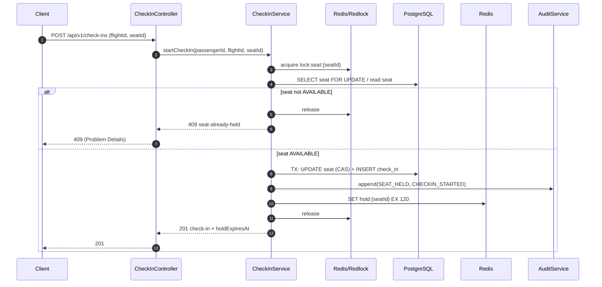
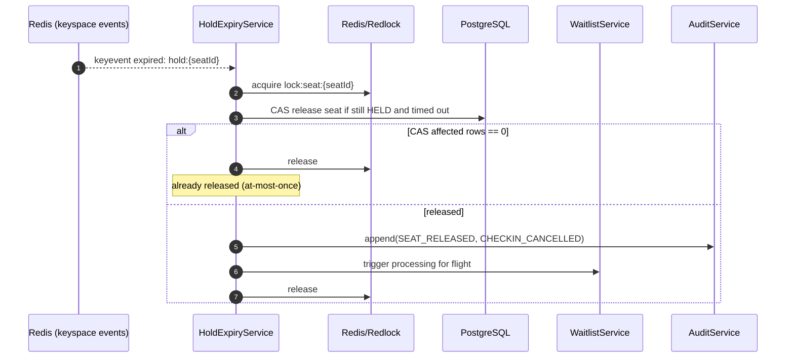

# Architecture (SkyHigh Core)

This document describes the architecture of **SkyHigh Core**, a NestJS backend service that powers a high-concurrency digital check-in system.

## Goals & non-goals

### Goals

- **Conflict-free seat assignment** under heavy contention.
- **Time-bound seat holds** with reliable expiry.
- **Fast seat-map reads** via short-lived caching.
- **Fair waitlist processing** (FIFO) when inventory becomes available.
- **Abuse protection** for high-frequency read endpoints.
- **Operational visibility** (logs, metrics, traces).

### Non-goals

- Flight scheduling / gate ops.
- Boarding pass generation.
- Payment processing internals (integrated via external service).

## System context (C4: Context)

```mermaid
flowchart LR
  passenger[Passenger / Client
(Web/Mobile/Kiosk)] -->|REST / JWT| core[SkyHigh Core
(NestJS)]

  core -->|SQL (TypeORM)| pg[(PostgreSQL)]
  core -->|Cache / Locks| redis[(Redis)]

  core -->|HTTP| pay[Payment Service
(stubbed locally)]
  core -->|HTTP| weight[Weight Service
(stubbed locally)]
  core -->|HTTP| notif[Notification Service
(stubbed locally)]

  ops[Ops / SRE] -->|/metrics| core
  ops -->|Logs / Traces| core
```

## Containers (C4: Container)

```mermaid
flowchart TB
  subgraph client[Clients]
    c1[Web]
    c2[Mobile]
    c3[Kiosk]
  end

  subgraph svc[SkyHigh Core (single deployable service)]
    api[REST API
NestJS Controllers]
    domain[Domain Services
Seat/Check-in/Waitlist/etc.]
    infra[Infrastructure
Redis/TypeORM/HTTP clients]
    obs[Observability
Pino + Prometheus + OTel]
  end

  subgraph data[Data stores]
    pg[(PostgreSQL 16)]
    redis[(Redis 7)]
  end

  subgraph deps[External dependencies]
    pay[Payment Service]
    weight[Weight Service]
    notif[Notification Service]
  end

  c1 --> api
  c2 --> api
  c3 --> api

  api --> domain
  domain --> infra
  infra --> pg
  infra --> redis
  infra --> pay
  infra --> weight
  infra --> notif

  api --> obs
  domain --> obs
  infra --> obs
```

## Runtime building blocks (C4: Component)

### Module boundaries (NestJS)

- **`HealthModule`**
  - Liveness/readiness, checks DB/Redis connectivity.
- **`FlightModule`**
  - Read-oriented flight listing and details.
- **`SeatModule`**
  - Seat map retrieval and short TTL caching.
- **`CheckInModule`**
  - Orchestrates seat hold, confirmation, cancellation.
  - Owns hold expiry mechanisms.
- **`WaitlistModule`**
  - FIFO queue per flight and auto-assignment when seats become available.
- **`BaggageModule`**
  - Validates baggage weight; computes excess fee.
- **`PaymentModule`**
  - Synchronous HTTP integration with retry/backoff.
- **`NotificationModule`**
  - Sends notifications to external notification service.
- **`AuditModule`**
  - Append-only audit logging and abuse event persistence.

### Cross-cutting infrastructure (`src/common/*`)

- **Config**: environment validation.
- **Database**: TypeORM configuration and migrations.
- **Redis**: client provider, Redlock, keyspace expiry subscription.
- **Auth**: global JWT validation guard.
- **Rate limiting**: Redis-backed sliding window middleware.
- **Errors**: global exception filter (RFC 7807 Problem Details).
- **Observability**: Prometheus metrics + OpenTelemetry tracing.

```mermaid
flowchart LR
  controller[Controller
HTTP boundary] --> service[Service
Business logic]
  service --> repo[TypeORM repositories
(PostgreSQL)]
  service --> rds[Redis
(cache/locks/ttl)]
  service --> http[HTTP clients
(payment/weight/notification)]
  service --> audit[AuditService
append-only log]
```

## Key data & consistency mechanisms

### Primary system of record: PostgreSQL

- Stores the authoritative state for:
  - flights, aircraft types, passengers
  - seats (state machine)
  - check-ins
  - waitlist
  - audit logs and abuse events

### Redis responsibilities

- **Distributed locks** (Redlock)
  - `lock:seat:{seatId}` for seat transitions
  - `lock:waitlist:{flightId}` for waitlist processing
- **Seat hold TTL**
  - `hold:{seatId}` with TTL = `SEAT_HOLD_TTL_SECONDS` (default 120s)
- **Seat map cache**
  - `seatmap:{flightId}` TTL ~ `SEAT_MAP_CACHE_TTL_MS` (default 2000ms)
- **Rate limiting**
  - `ratelimit:{ip}` as a sorted set sliding window

### Invariants

- **No double-booking**: seat transitions guarded by **lock + CAS update**.
- **At-most-once hold release**: keyspace expiry and sweep both run the same CAS release.
- **Waitlist fairness**: FIFO ordering per flight.

## Core flows (sequence diagrams)

### 1) Start check-in (seat hold)



### 2) Confirm check-in (baggage + payment gating)

```mermaid
sequenceDiagram
  autonumber
  participant Client
  participant API as CheckInController
  participant Svc as CheckInService
  participant DB as PostgreSQL
  participant Weight as Weight Service
  participant Pay as Payment Service
  participant Audit as AuditService

  Client->>API: PATCH /api/v1/check-ins/:id {baggageWeight, action:"CONFIRM"}
  API->>Svc: confirmCheckIn(checkInId, passengerId, baggageWeight)
  Svc->>DB: Load check-in + seat; validate hold not expired
  alt hold expired
    Svc-->>API: 410 hold-expired
    API-->>Client: 410
  else hold valid
    Svc->>Weight: validate/lookup weight
    alt baggage <= MAX_BAGGAGE_WEIGHT_KG
      Svc->>DB: TX: seat HELD->CONFIRMED, check-in -> COMPLETED
      Svc->>Audit: append(SEAT_CONFIRMED, CHECKIN_COMPLETED)
      API-->>Client: 200 COMPLETED
    else baggage > MAX_BAGGAGE_WEIGHT_KG
      Svc->>Pay: request payment (timeout + retry)
      alt payment confirmed
        Svc->>DB: TX: seat -> CONFIRMED, check-in -> COMPLETED + paymentId
        Svc->>Audit: append(PAYMENT_CONFIRMED, CHECKIN_COMPLETED)
        API-->>Client: 200 COMPLETED
      else payment not confirmed
        Svc->>DB: UPDATE check-in -> AWAITING_PAYMENT + excessFee
        Svc->>Audit: append(PAYMENT_REQUESTED)
        API-->>Client: 200 AWAITING_PAYMENT
      end
    end
  end
```

### 3) Hold expiry (keyspace + sweep fallback)



## Deployment view

### Local development (Docker Compose)

- `docker-compose.yml` starts:
  - `app` (NestJS)
  - `postgres` (PostgreSQL 16)
  - `redis` (Redis 7 with keyspace notifications enabled)
  - `pgadmin`
  - stub services: payment/weight/notification

### Production assumptions

- Stateless app instances (horizontal scaling supported).
- PostgreSQL is the system of record.
- Redis must be reachable and configured to support keyspace notifications if using expiry events.

## Observability

- **Logs**: `nestjs-pino` with `requestId` and trace context.
- **Metrics**: `/metrics` via Prometheus.
- **Tracing**: OpenTelemetry auto-instrumentation + manual spans around critical flows.

## References

- API contract: `API-SPECIFICATION.yml`
- Product requirements: `PRD.md`
- Technical design: `technical-prd.md`
- Source entrypoints: `src/main.ts`, `src/app.module.ts`
