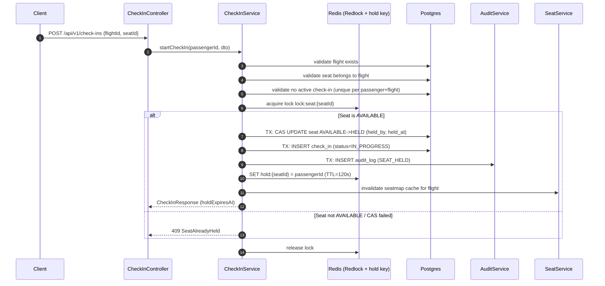
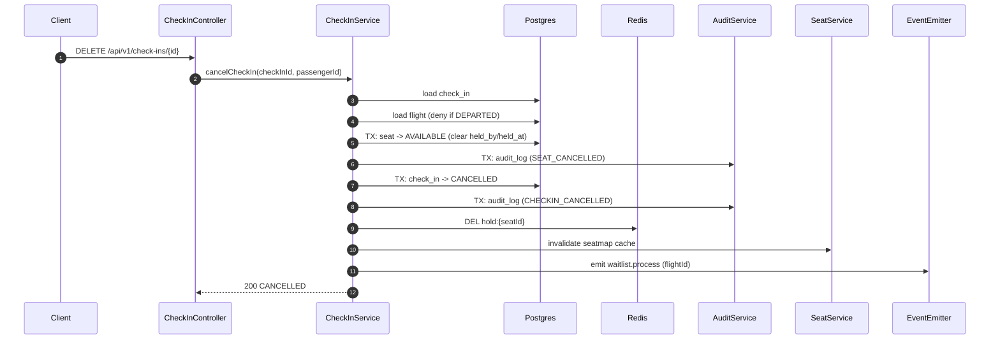
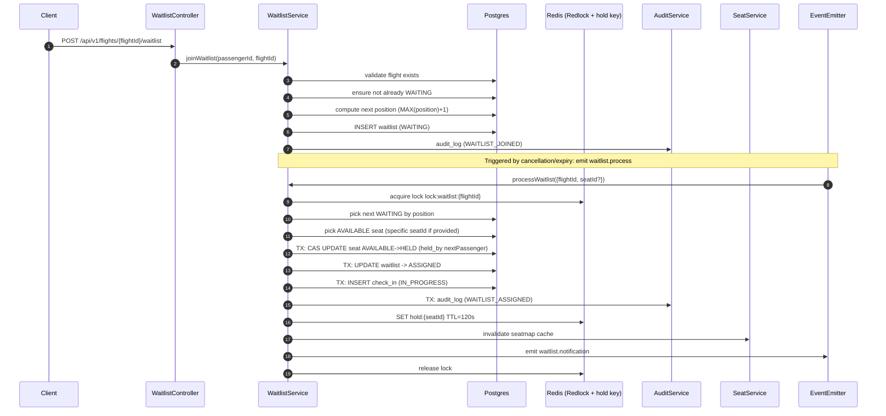

# Workflow Design

This document explains the runtime workflows implemented in this repository, focusing on the primary end-user flows (seat map, check-in, baggage/payment gating, cancellation) and the internal operational flows (hold expiry, waitlist auto-assignment, audit/history).

## Core Concepts

### State Machines

- **Seat (`seat.status`)**
  - `AVAILABLE` -> `HELD` -> `CONFIRMED` -> `AVAILABLE`
  - `CANCELLED` exists as an enum value, but the primary operational lifecycle is the loop above.

- **Check-in (`check_in.status`)**
  - `IN_PROGRESS` -> `COMPLETED`
  - `IN_PROGRESS` -> `AWAITING_PAYMENT` -> `COMPLETED`
  - `IN_PROGRESS` -> `CANCELLED`

- **Waitlist (`waitlist.status`)**
  - `WAITING` -> `ASSIGNED` -> `EXPIRED`
  - `WAITING` -> `CANCELLED`

### Concurrency & Consistency Strategy

- **Distributed lock (Redlock)** for critical sections:
  - `lock:seat:{seatId}` guards seat hold/release.
  - `lock:waitlist:{flightId}` guards FIFO assignment.
- **Compare-and-swap (CAS)** updates in Postgres (single-row conditional updates) to guarantee:
  - exactly one successful seat hold per seat at a time.
  - at-most-once seat release when both expiry mechanisms run.
- **Redis as ephemeral state** for high-concurrency/time-bound behavior:
  - a short-lived `hold:{seatId}` key models the 120s hold window.
  - a short-lived `seatmap:{flightId}` cache accelerates reads.

### Append-only Audit History

All meaningful state transitions are recorded to `audit_log` (append-only). This is the system’s authoritative **state transition history**, independent of the current state in the main tables.

---

## Primary Flows (Diagrams)

### 1) Seat Map Retrieval (cached)

```mermaid
flowchart TD
  A[Client] -->|GET /api/v1/flights/{flightId}/seats| B[SeatController]
  B --> C[SeatService.getSeatMap]
  C --> D{Redis cache hit?\nseatmap:{flightId}}
  D -->|Yes| E[Return cached seat map]
  D -->|No| F[Load flight + aircraftType from Postgres]
  F --> G[Load seats from Postgres\norder by row/column]
  G --> H[Build SeatMapResponse]
  H --> I[SET seatmap:{flightId} TTL=~2s]
  I --> J[Return seat map]
```

Key notes:
- Cache is **invalidated** on any seat state change (`SeatService.invalidateCache`).

---

### 2) Start Check-in (Seat Hold)



Key notes:
- The DB update uses a CAS predicate (`WHERE id=:seatId AND status='AVAILABLE'`) to prevent races even inside the lock.
- `check_in` has a unique constraint on `(passenger_id, flight_id)`.

---

### 3) Confirm Check-in (Baggage + Optional Payment Gating)

```mermaid
flowchart TD
  A[Client PATCH /api/v1/check-ins/{id}] --> B[CheckInService.confirmCheckIn]
  B --> C[Validate check-in exists for passenger]
  C --> D[Validate hold not expired\n(hold:{seatId} exists + status in IN_PROGRESS/AWAITING_PAYMENT)]
  D --> E[BaggageService.validateAndCalculateFee]
  E --> F{Overweight?}
  F -->|No| G[TX: seat HELD->CONFIRMED\ncheck_in -> COMPLETED\naudit_log SEAT_CONFIRMED + CHECKIN_COMPLETED]
  G --> H[DEL hold:{seatId}]
  H --> I[invalidate seatmap cache]
  I --> J[Return COMPLETED]

  F -->|Yes| K[Update check_in -> AWAITING_PAYMENT\nstore baggageWeight + excessFee]
  K --> L[PaymentService.processPayment (sync HTTP + retries)]
  L --> M{Payment confirmed?}
  M -->|Yes| N[TX: seat HELD->CONFIRMED\ncheck_in -> COMPLETED\nstore paymentId\naudit logs]
  N --> H
  M -->|No| O[Return AWAITING_PAYMENT (passenger can retry)]
```

Key notes:
- The 120s hold window continues while payment is attempted.
- Payment failures are **non-throwing**: the flow returns `AWAITING_PAYMENT`.

---

### 4) Cancel Check-in



Key notes:
- Cancellation is blocked after departure (`flight.status = DEPARTED`).
- Cancellation triggers waitlist processing so released capacity is immediately offered.

---

### 5) Hold Expiry (Dual Mechanism, At-Most-Once)

There are two mechanisms to release an expired seat hold:
- **Primary:** Redis keyspace notification on `hold:{seatId}` expiry.
- **Fallback:** cron sweep (every 30 seconds) for stale `seat.status=HELD` where `held_at + 120s < now()`.

Both call the same CAS release logic under the seat lock.

```mermaid
flowchart TD
  A[Redis keyspace: hold:{seatId} expired] --> C[HoldExpiryService.releaseSeat]
  B[Cron sweep finds stale HELD seats] --> C
  C --> D[Acquire lock:seat:{seatId}]
  D --> E{Seat is HELD\nand hold truly expired?}
  E -->|No| F[No-op (already released / not expired)]
  E -->|Yes| G[TX: CAS UPDATE seat HELD->AVAILABLE]
  G --> H[TX: UPDATE check_in IN_PROGRESS->CANCELLED (by seatId)]
  H --> I[TX: INSERT audit_log (SEAT_RELEASED)]
  I --> J[Mark waitlist entry EXPIRED if it was ASSIGNED]
  J --> K[invalidate seatmap cache]
  K --> L[Emit waitlist.process (flightId, seatId)]
  L --> M[Release lock]
```

Key notes:
- The CAS predicate includes `held_by` (owner) to prevent a double-release.
- This design guarantees **at-most-once** release even if both mechanisms run.

---

### 6) Waitlist Join + Auto-Assignment



Key notes:
- Waitlist processing is serialized per flight via `lock:waitlist:{flightId}`.
- When a waitlist-assigned hold expires, the entry becomes `EXPIRED` and processing re-triggers.

---

## Database Schema

Source of truth:
- Migration: `migrations/1771000615393-InitialSchema.ts`
- Entities: `src/**/**.entity.ts`

### Entity Relationship Overview

```mermaid
erDiagram
  AIRCRAFT_TYPE ||--o{ FLIGHT : has
  FLIGHT ||--o{ SEAT : has
  PASSENGER ||--o{ CHECK_IN : creates
  FLIGHT ||--o{ CHECK_IN : for
  SEAT ||--o{ CHECK_IN : selected
  FLIGHT ||--o{ WAITLIST : queue
  PASSENGER ||--o{ WAITLIST : joins

  AIRCRAFT_TYPE {
    uuid id PK
    varchar name
    int rows
    varchar columns
    timestamptz created_at
    timestamptz updated_at
  }

  FLIGHT {
    uuid id PK
    varchar flight_number
    uuid aircraft_type_id FK
    timestamptz departure_time
    enum status
    timestamptz created_at
    timestamptz updated_at
  }

  SEAT {
    uuid id PK
    uuid flight_id FK
    int row
    varchar column
    enum status
    uuid held_by FK
    timestamptz held_at
    timestamptz created_at
    timestamptz updated_at
  }

  PASSENGER {
    uuid id PK
    varchar first_name
    varchar last_name
    varchar email UNIQUE
    timestamptz created_at
    timestamptz updated_at
  }

  CHECK_IN {
    uuid id PK
    uuid passenger_id FK
    uuid flight_id FK
    uuid seat_id FK NULL
    enum status
    numeric baggage_weight NULL
    numeric excess_fee NULL
    varchar payment_id NULL
    timestamptz created_at
    timestamptz updated_at
  }

  WAITLIST {
    uuid id PK
    uuid flight_id FK
    uuid passenger_id FK
    int position
    enum status
    timestamptz created_at
    timestamptz updated_at
  }

  AUDIT_LOG {
    uuid id PK
    varchar entity_type
    uuid entity_id
    enum action
    varchar from_state NULL
    varchar to_state
    uuid actor_id
    jsonb metadata NULL
    timestamptz created_at
  }

  ABUSE_EVENT {
    uuid id PK
    varchar source_ip
    int request_count
    timestamptz window_start
    timestamptz window_end
    jsonb details NULL
    timestamptz created_at
  }
```

### Table-by-table Notes

#### `aircraft_type`
- Defines aircraft layout (rows + columns CSV).
- Referenced by `flight.aircraft_type_id`.

#### `flight`
- Read-mostly aggregate root for seat map and check-in flows.
- Relationships:
  - `flight 1->N seat`
  - `flight 1->N check_in`
  - `flight 1->N waitlist`

#### `seat`
- The core concurrency hotspot.
- Uniqueness: `UQ_seat_flight_row_column (flight_id, row, column)`.
- Operational indexes:
  - `(flight_id, status)` to find available seats quickly.
  - `(held_by)` to trace holds by passenger.
- Hold metadata:
  - `held_by` and `held_at` support sweep-based expiry detection.

#### `passenger`
- Passenger identity is external (JWT `sub`) but stored for relational integrity in seeded/test contexts.

#### `check_in`
- Represents an in-progress or completed check-in attempt.
- Uniqueness: `UQ_checkin_passenger_flight (passenger_id, flight_id)` prevents multiple active check-ins.
- Stores:
  - `baggage_weight`, `excess_fee` and `payment_id` for baggage/payment gating.

#### `waitlist`
- FIFO queue per flight.
- Uniqueness: `UQ_waitlist_flight_passenger (flight_id, passenger_id)`.
- Indexed by `(flight_id, status, position)` for fast retrieval of next waiting passenger.

#### `audit_log` (State History)
- **Append-only ledger** of state transitions across entities.
- Indexed by:
  - `(entity_type, entity_id)` for entity timelines.
  - `created_at` for time-based analysis.
- Used for:
  - post-incident reconstruction,
  - debugging race conditions,
  - compliance-style traceability.

#### `abuse_event`
- Records rate-limit abuse detections (source IP and window).
- A scheduled cleanup removes old records based on retention config.

---

## How State History Is Stored

- **Current state** is stored on the primary tables (`seat.status`, `check_in.status`, `waitlist.status`).
- **History of transitions** is stored in `audit_log`:
  - each row captures `entityType`, `entityId`, `action`, `fromState`, `toState`, `actorId`, and `metadata`.
  - examples include:
    - `SEAT_HELD`, `SEAT_CONFIRMED`, `SEAT_RELEASED`, `SEAT_CANCELLED`
    - `CHECKIN_COMPLETED`, `CHECKIN_CANCELLED`
    - `WAITLIST_JOINED`, `WAITLIST_ASSIGNED`
    - `PAYMENT_REQUESTED`, `PAYMENT_CONFIRMED`

This separation keeps transactional tables lean while preserving an immutable event trail.

---

## Redis Keys (Operational State)

- `seatmap:{flightId}`
  - cached seat map JSON, TTL ~2s
- `hold:{seatId}`
  - seat hold owner (passengerId), TTL 120s
- `lock:seat:{seatId}`
  - Redlock resource for seat hold / release
- `lock:waitlist:{flightId}`
  - Redlock resource for per-flight waitlist assignment

---

## Status

- Flow diagrams: included for the primary runtime flows.
- Database schema: documented with an ER diagram + relationship notes.
- State history: explained via append-only `audit_log` + operational Redis keys.
